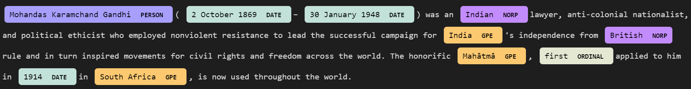

# Extract Named Entities

Using spaCy models already trained in databases, with the technique called NER (Named-Entity Recognition).

###_*Text_*

Extracted from Wikipedia: https://en.wikipedia.org/wiki/Mahatma_Gandhi

"Mohandas Karamchand Gandhi (2 October 1869 – 30 January 1948) was an Indian lawyer, anti-colonial nationalist, and political ethicist who employed nonviolent resistance to lead the successful campaign for India's independence from British rule and in turn inspired movements for civil rights and freedom across the world. The honorific Mahātmā, first applied to him in 1914 in South Africa, is now used throughout the world."

###_*Entity view_*
```
Mohandas Karamchand Gandhi PERSON
2 October 1869 DATE
30 January 1948 DATE
Indian NORP
India GPE
British NORP
Mahātmā GPE
first ORDINAL
1914 DATE
South Africa GPE
```

